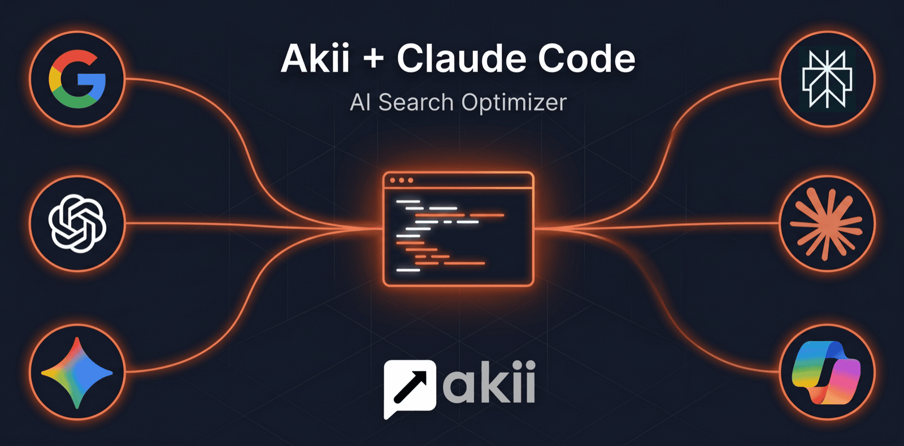

# Akii — SEO & AI Search Optimizer

<p align="center">
  
</p>

[](./LICENSE)
[](https://github.com/akii-technologies-ltd/akii-seo-ai-search-optimizer/releases)
[](https://github.com/akii-technologies-ltd/akii-seo-ai-search-optimizer/actions/workflows/validate.yml)
[](https://code.claude.com/docs/en/plugins)
[](https://akii.com/claude-code)
[](https://github.com/akii-technologies-ltd/akii-seo-ai-search-optimizer/stargazers)

Free AI-powered SEO, AEO, and GEO toolkit by [Akii](https://akii.com/?utm_source=plugin&utm_medium=readme&utm_campaign=akii_plugin_v1) for [Claude Code](https://code.claude.com/docs/en/plugins).

**Aligned with [Google's AI Optimization Guide](https://developers.google.com/search/docs/fundamentals/ai-optimization-guide) for Google AI Overviews + AI Mode** — and extends those foundations to the 5 other engines (ChatGPT, Claude, Gemini, Perplexity, Copilot) using peer-reviewed cross-engine research where Google doesn't have jurisdiction.

**All skills run on your Claude Code session model** (Claude Sonnet / Opus / etc) — same model you're already using.

Audit websites, plan content strategy, optimize pages, generate schema markup, cluster keywords, **estimate** your AI visibility for ChatGPT, Claude, Gemini, Perplexity, Copilot, and Google AI Overviews, generate `llms.txt` for non-Google AI crawlers, and apply the cross-engine GEO rewrite tactics from the Princeton/IIT Delhi study ([Aggarwal et al., KDD 2024, arXiv:2311.09735](https://arxiv.org/abs/2311.09735)) — all without leaving your terminal or IDE.

> **On the AI Visibility Score specifically:** that one skill (and its `/ai-visibility-score` command) calls the Akii backend, which uses Llama 4 / DeepSeek V4 Pro as an LLM judge against your brand's public footprint (Phase 1) plus a per-engine signal-correlation proxy (Phase 2 — done by your Claude Code session). It does NOT directly query ChatGPT, Claude, Gemini, Perplexity, or Copilot. Direct multi-engine querying is a paid Akii platform feature. See [AUTHORITIES.md](./AUTHORITIES.md) § "What this plugin actually measures" for full methodology.

See [AUTHORITIES.md](./AUTHORITIES.md) for how each source is scoped (Google guide → Google AI surfaces · Princeton paper → cross-engine GEO tactics · FirstPageSage breakdown → per-engine signal correlations).

## Installation

Install directly from this GitHub repo. **Inside the Claude Code prompt, run these as two separate commands — paste the first, press Enter, then paste the second.** Pasting both at once concatenates them with a space and Claude Code treats the whole blob as one broken `/plugin marketplace add` call.

**Step 1 — add the marketplace:**

```
/plugin marketplace add https://github.com/akii-technologies-ltd/akii-seo-ai-search-optimizer
```

**Step 2 — install the plugin:**

```
/plugin install akii-seo-ai-search-optimizer@akii
```

> Use the full `https://` URL above — the short `owner/repo` form makes Claude Code clone via SSH on some systems and fails if you don't have a GitHub SSH key configured.

> Submitted to the [Anthropic community marketplace](https://github.com/anthropics/claude-plugins-community) — pending review. Once accepted, you'll also be able to install with:
>
> ```bash
> /plugin marketplace add anthropics/claude-plugins-community
> /plugin install akii-seo-ai-search-optimizer@claude-community
> ```

### Updating

Third-party Claude Code marketplaces have auto-update disabled by default. Two paths:

**Recommended — enable auto-update once, never think about it again:**

```
/plugin
```

Press Enter, navigate to **Marketplaces** tab → `akii` → **Enable auto-update**.

After that, every Claude Code startup refreshes the marketplace + updates installed plugins to the latest version. A notification will prompt `/reload-plugins` if updates landed.

**Manual update per release:** paste each command separately, press Enter between:

```
/plugin marketplace update akii
```

```
/reload-plugins
```

The first refreshes the marketplace catalog from GitHub; the second activates the updated plugin in the current session.

### Quick start

After install, try this first to see what the plugin does — just ask in natural language:

> "What's my AI visibility for yourdomain.com?"

The `ai-visibility` skill auto-triggers and returns the Akii 0–100 score (4-dimension breakdown) plus a per-engine proxy map for ChatGPT, Claude, Gemini, Perplexity, Copilot, and Google AI Overviews. From there, ask things like *"audit my site"*, *"compare my SEO against competitor.com"*, or *"apply GEO optimization to ./blog/my-post.md"* — skills auto-trigger on natural language.

## What's included

### Skills (12)

Skills activate automatically when you ask about these topics. Grouped by workflow:

**Audit**
| Skill | What it does |
| --- | --- |
| **SEO Audit** | Unified SEO + AEO + GEO audit across 12 layers. `--mode=full` (default) gives the full scorecard with Core Web Vitals + JS rendering + crawlability depth inline. `--mode=quick` = scorecard only. `--mode=technical` = infrastructure-only deep dive (CWV, crawlability, indexation, JS rendering, HTTPS / HSTS / mixed content). |
| **Broken Links** | Find and fix dead links + redirect chains |
| **Competitor Intel** | Head-to-head SEO + AEO + GEO + AI visibility scorecard vs named competitors |

**Optimize**
| Skill | What it does |
| --- | --- |
| **Optimize Page** | Full SEO + AEO + GEO pass on a single page — title/meta/H1/links + chunk-quality + GEO rewrites using tactics from the Princeton/IIT Delhi GEO study (`--mode=full\|seo\|aeo\|geo`) |
| **Schema Markup** | Generate JSON-LD with `sameAs`, granular LocalBusiness, AEO fields |
| **Internal Linking** | Orphans, anchor diversity, link-equity flow |

**Content**
| Skill | What it does |
| --- | --- |
| **Content Strategy** | Data-grounded content roadmap with pillars + clusters |
| **Content Brief** | Detailed briefs for writers (human or AI) |
| **Keyword Clustering** | Intent-matched topical clusters → pillar + cluster pages |

**AI Search**
| Skill | What it does |
| --- | --- |
| **AI Visibility** | Akii 0–100 score (4-dim breakdown, computed by Llama 4 / DeepSeek V4 Pro as LLM judge) + per-engine proxy map for ChatGPT, Claude, Gemini, Perplexity, Copilot, Google AI Overviews (FirstPageSage signal weights, NOT direct engine queries) |
| **llms.txt** | Generate/maintain `llms.txt` + `llms-full.txt` |

**Localization**
| Skill | What it does |
| --- | --- |
| **Content Translation** | Localize with per-locale keyword research + hreflang |

### Agents (5)

Autonomous agents for deep, multi-step work. Each agent has a fast-path skill counterpart (see routing table below). Agents only fire on explicit "deep / agent / autonomous / bulk" phrasing — never on generic triggers.

| Agent | What it does | Fast-path skill |
| --- | --- | --- |
| **SEO Auditor** | Full autonomous site audit with scored report | `seo-audit` |
| **Content Strategist** | Multi-pass site + competitor crawl → complete plan | `content-strategy` |
| **Competitor Analyzer** | 5+ competitors, full backlink + keyword overlap | `competitor-intel` |
| **AI Visibility Analyzer** | Multi-engine real-query probes + 30-day plan | `ai-visibility` |
| **Schema Generator** | Bulk JSON-LD across many pages, writes into source | `schema-markup` |

#### Routing contract

When in doubt, the **skill** is the default for any question in its capability area. The **agent** only triggers when the user explicitly says one of: `deep`, `agent mode`, `autonomous`, `bulk`, `across my site`, `every page`, `5+ competitors`, `comprehensive`. If you want the agent specifically, name it: e.g. *"run the schema-generator agent"*.

### Commands (3)

Three argument-driven slash commands for operations that benefit from positional `$ARGUMENTS` parsing. Everything else triggers through the skill catalog above — either via natural language ("translate this to German", "generate schema for this page") or by typing the skill's slash slug (`/akii-seo-ai-search-optimizer:content-translation`, `/akii-seo-ai-search-optimizer:schema-markup`, etc.).

| Command | What it does |
| --- | --- |
| `/create-topic <seed>` | Research and generate a full topic plan |
| `/create-content <topic>` | Generate a full SEO + AEO + GEO-optimized article |
| `/check-file [file]` | Quick SEO + AEO check on a single file |

## Examples

```
# Get your real Akii AI Visibility Score (0–100) — the headline feature
"What's my AI visibility for example.com?"

# Research topics for your niche
/create-topic "SaaS marketing"

# Full SEO + AEO + GEO audit
"Audit the SEO of my website"

# Generate content
/create-content "how to improve website speed"

# Quick check on the open file
/check-file src/app/page.tsx

# Per-engine AI visibility breakdown
"How does my brand rank in ChatGPT vs Gemini vs Perplexity vs Claude?"

# Localize for Mexico
"Translate this to Spanish (Mexico)"

# Cluster keywords
"Cluster these keywords: seo tools, best seo software, seo audit, website optimization, keyword research tool"

# Generate schema for the open file
"Generate Article schema for this file"

# Compare against competitors
"Compare my SEO against competitor1.com and competitor2.com"

# Apply Princeton GEO method to a blog post
"Apply GEO optimization to ./blog/my-post.md"  # routes to optimize-page --mode=geo

# Generate llms.txt for the AI crawlers
"Generate llms.txt for this site"
```

## Auto-detected third-party MCPs

The plugin works standalone using Claude's built-in tools (`WebFetch`, `WebSearch`, `Read`, `Glob`, `Grep`, `Bash`). But if you've already connected any of the following MCPs, skills automatically use them for richer, real-data outputs:

| MCP | What it adds |
| --- | --- |
| **Ahrefs** (`mcp__plugin_marketing_ahrefs__*`) | Real DR, backlinks, organic keyword data, brand-radar AI mention tracking, GSC integration |
| **Google Search Console** (via Ahrefs plugin) | Real click, impression, position data |
| **Apify** (`mcp__Apify__*`) | Richer SERP scrapes, social-mention scraping |
| **PageSpeed Insights API** | Real Core Web Vitals — set `AKII_PSI_KEY` env var to enable (used by `seo-audit` skill in `--mode=full` or `--mode=technical`) |

No extra configuration needed. Skills auto-detect and degrade gracefully if the MCP isn't installed.

## Telemetry

The plugin sends a single anonymized HTTP POST to `https://akii.com/api/plugin-telemetry` at most **once per machine per 24 hours** from the SessionEnd hook. The full payload is:

```json
{
  "plugin_version": "2.9.0",
  "session_hash": "<16-hex-char sha256 prefix of machine UUID>",
  "os": "Darwin",
  "timestamp": "2026-05-27T18:00:00Z"
}
```

That is the entire payload. The plugin never sends code, file paths, prompts, skill outputs, audited domains, bash commands, or anything else from your session. We use this to count active installs and version distribution. Full details — what's collected field-by-field, what isn't, why, and how to verify the implementation locally — are in [PRIVACY.md](./PRIVACY.md).

**To disable**, set any one of:

| Env var | Scope |
| --- | --- |
| `AKII_PLUGIN_DISABLE_TELEMETRY=1` | Disables telemetry only |
| `AKII_PLUGIN_DISABLE_CTA=1` | Disables the entire SessionEnd hook (CTA + version nudge + telemetry) |
| `CLAUDE_CODE_DISABLE_NONESSENTIAL_TRAFFIC=1` | Anthropic's standard universal kill switch |
| `DO_NOT_TRACK=1` | Web standard |

Telemetry is **default-off** on Amazon Bedrock, Google Cloud Vertex, Microsoft Foundry, and Claude Platform on AWS, matching Anthropic's own posture for commercial-provider users.

## Compatibility

| Surface | Tested against |
| --- | --- |
| Claude Code CLI | `2.0.x` and later (skill / agent / hook spec v2) |
| Plugin spec | `marketplace.json` v1, `plugin.json` v1, `hooks.json` v1 |
| OS | macOS, Linux. Windows untested (the hook uses POSIX `bash`; should work under WSL). |

If you hit a compatibility issue with a newer Claude Code release, please open an issue with `claude --version` output. Full compatibility matrix (MCPs, env vars, known limitations) is in [COMPATIBILITY.md](./COMPATIBILITY.md).

## What this plugin covers vs the [Akii](https://akii.com/?utm_source=plugin&utm_medium=readme&utm_campaign=akii_plugin_v1) platform

| Capability | This Plugin (Free) | Akii Platform |
| --- | :---: | :---: |
| Codebase + URL audits | ✅ | ✅ |
| Schema, AEO, GEO optimization | ✅ | ✅ |
| Content briefs + content generation | ✅ | ✅ |
| Keyword clustering | ✅ | ✅ |
| AI visibility — 0–100 score (LLM-judge proxy) + per-engine signal map (one-shot) | ✅ | ✅ |
| AI visibility — **direct per-engine querying** (real ChatGPT / Claude / Gemini / Perplexity / Copilot responses) | — | ✅ |
| AI visibility — **continuous 24/7 multi-engine tracking** | — | ✅ |
| Real-time alerts when visibility drops | — | ✅ |
| Multi-brand / agency dashboard | — | ✅ |
| Per-engine direct querying at scale | — | ✅ |
| Geo-targeted AI Engage (region-specific) | — | ✅ |
| Automated PR / commit deploys for fixes | — | ✅ |
| Team collaboration + role permissions | — | ✅ |
| Historical trend data + reporting | — | ✅ |

If you outgrow the one-shot plugin, the [Akii platform](https://akii.com/?utm_source=plugin&utm_medium=readme&utm_campaign=akii_plugin_v1) automates these continuously across multiple brands with alerts, dashboards, and direct per-engine querying.

## Why free?

We believe every website deserves great SEO + AEO + GEO. This toolkit gives you professional-grade visibility capabilities right inside your AI assistant — with no login, no signup, no usage cap.

For automated, continuous AI visibility monitoring at scale across Google AI Search, Google AI Overviews, ChatGPT, Claude, Gemini, Copilot, and Perplexity — with alerts, multi-brand dashboards, automated remediation, and team features — check out the full [Akii](https://akii.com/?utm_source=plugin&utm_medium=readme&utm_campaign=akii_plugin_v1) platform.

## Contributing

PRs welcome. See [CONTRIBUTING.md](./CONTRIBUTING.md) for repo layout, validator gate, skill / agent / command authoring conventions, citation rules, and the release process.

## Security

Report vulnerabilities privately per [SECURITY.md](./SECURITY.md). Please do not open a public issue.

## License

[MIT](./LICENSE) — free for personal and commercial use.

---

Built by [Akii](https://akii.com/?utm_source=plugin&utm_medium=readme&utm_campaign=akii_plugin_v1) — *continuous AI visibility monitoring for the AI-first internet*.
